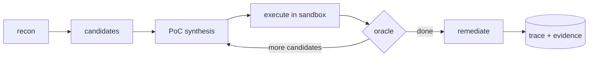

# Argus

**An autonomous agent that finds one class of vulnerability, IDOR / broken access control, and *proves* each finding by generating and executing a real exploit in an isolated sandbox.** Every result is a verdict with evidence: exploit confirmed, or false positive rejected.

The proof loop is the product. Argus does not flag "possible" issues and leave you to triage a pile of maybes. It tries the attack, in a sandbox, and shows you exactly what happened.

**Live demo:** [argus-vatsalya.vercel.app](https://argus-vatsalya.vercel.app)

```bash
pip install argus-idor

argus eval                       # the precision/recall benchmark (no key, no Docker)
argus scan --provider gemini     # run the full loop: deepseek | openai | gemini
```

## Prove it, don't guess

Most scanners produce a long list of *maybes*. The real issues get buried, and a human has to confirm each one by hand. Argus takes the opposite bet on a single, narrow problem and goes deep:

1. it finds candidate access-control issues,
2. it generates a concrete proof-of-concept exploit,
3. it runs that exploit against an authorized target **inside a sandbox that can reach only that target**, and
4. it returns a verdict with the evidence that justifies it:
   * **Confirmed:** here is the exact request and response showing one user holding another user's private data.
   * **Rejected (false positive):** the access control held, here is the `403`. Not a bug.

That second outcome, confidently and verifiably saying *"this is not a vulnerability,"* is the signature behavior and the hard part almost nothing does well.

## The bug it hunts: IDOR

IDOR (Insecure Direct Object Reference) is when an app lets you reach **someone else's** object just by changing an identifier in the request, for example opening `/api/invoices/124` when only `/api/invoices/123` is yours, because the handler forgot to check *"does this belong to the caller?"* It is one of the most common and most serious bugs in fast-built apps, precisely because that ownership check is so easy to omit.

## Benchmark

Argus ships with two deliberately-vulnerable targets, each containing **real holes** and **decoys** (endpoints that take an object id and *look* exploitable but are correctly authorized):

| Target | What it is | Cases | Result |
|---|---|---|---|
| `saas` | billing app: invoices, documents, messages (2 principals) | 12 | precision 1.00, recall 1.00 |
| `clinic` | patient-records API: numeric ids, 3 principals | 36 | precision 1.00, recall 1.00 |
| **Overall** | | **48** | **24 IDORs confirmed, 24 decoys rejected, 0 false positives** |

The oracle decides from *behavior alone*; the ground-truth labels are used only to **score** the run, never during detection, so the number is earned, not read off an answer key. Run it yourself: `argus eval`.

## How it works



A single LangGraph state machine (one agent, not a swarm) drives the loop: **recon** (crawl the target, enumerate endpoints and object ids) to **candidates** (the LLM proposes cross-user tests) to **PoC synthesis** (the LLM writes the exploit request) to **execute** (fire it in the sandbox) to **oracle** (the deterministic verdict) to **remediate** (a fix suggestion, for confirmed findings only).

Three design choices carry the whole thing:

* **The LLM proposes; a deterministic oracle disposes.** The model hypothesizes candidates and writes exploits, but it *never* renders the verdict. A plain, deterministic function does, from evidence. The AI never grades its own homework.
* **One agent, one tight loop.** LangGraph models the loop as an explicit state machine of steps, which stays legible and matches the single-family scope.
* **The guardrail lives in the network, not a prompt.** Exploits run in a Docker container on an `internal` network (no gateway to the internet). By construction the sandbox can reach the authorized target and nothing else, and a self-check proves the open internet is unreachable from inside.

## How the oracle decides (the core)

For an attempt where attacker A and victim B are different principals, Argus confirms an IDOR **only if all three hold**:

1. **status:** A got a `2xx` it should not have,
2. **content:** the response actually contains B's unique data (so it is really B's object, not A's own data and not an empty `200`), and
3. **cross-principal:** A and B are genuinely different users.

Anything else is a **false positive**, and the verdict carries the reason the access was *not* a breach ("access denied (HTTP 403); access control held", "2xx but no victim data; no leak"). Knowing B's data is legitimate (you hold two of your own test accounts); knowing the *label* would be cheating, so the detector never sees it. That separation is why the precision number means something.

## Install and run

```bash
pip install argus-idor          # or: pipx install argus-idor (isolated, recommended)

argus eval                      # benchmark across the bundled targets, no key, no Docker

# full sandboxed run (needs Docker running + one provider key in the environment):
export DEEPSEEK_API_KEY=...      # or OPENAI_API_KEY / GEMINI_API_KEY
argus scan --provider deepseek   # deepseek | openai | gemini
```

The LLM is provider-agnostic (any OpenAI-compatible API). Gemini defaults to the free `gemini-2.0-flash`. Keys are read from the environment, never passed on the command line.

## Project layout

```
target/   first deliberately-vulnerable app + its ground-truth manifest
target2/  second target (patient records), a different shape
agent/    the loop: schemas, LLM client, the six nodes, the graph, and the oracle
runner/   the Docker sandbox + the network-level egress guardrail
cli/      the argus command
evals/    the scorecard (precision/recall + confusion matrix)
dashboard/ Next.js replay of a captured run
traces/   captured run evidence (JSON)
```

## Scope, narrow on purpose

Argus is deliberately **one vulnerability family, done deeply**. These are explicit non-goals, not missing features:

* No other vulnerability families, until the IDOR loop's precision/recall bar is met.
* No "graph of agents" swarm. One agent, one orchestrated loop.
* No pointing the tool at arbitrary live targets. It attacks only the bundled/authorized target, a guardrail enforced at the network layer.

## Roadmap

* [x] Two vulnerable targets + ground-truth manifests
* [x] The validation loop (recon to oracle), CLI, end-to-end
* [x] Docker sandbox + egress guardrail
* [x] Eval harness (precision/recall + confusion matrix)
* [x] Installable, multi-provider (`pip install argus-idor`)
* [x] Replay dashboard ([live demo](https://argus-vatsalya.vercel.app))
* [ ] `--target` for your own locally-authorized app
* [ ] CI (scan on push, publish the evidence artifact)

## Contributing

Contributions are welcome. Please read **[CONTRIBUTING.md](CONTRIBUTING.md)** first, especially the scope section (it is what keeps the project focused). Good first areas: harder target endpoints and decoys, more eval cases, the dashboard, and new object-reference patterns for recon to discover.

## License

[MIT](LICENSE) (c) 2026 Vatsalya Soni.
